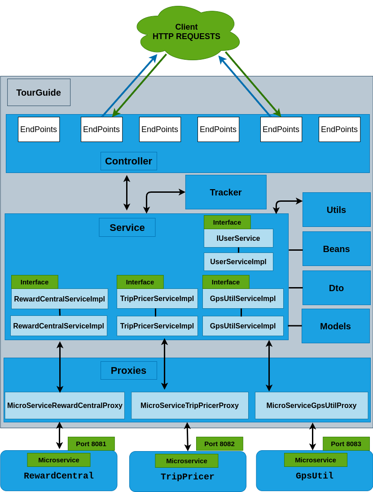

# TourGuideProject

  

OpenClassrooms project number 8  

TourGuide is a TripMaster application who allows users to see what are the
nearby tourist attractions and get discounts on hotel stays as well as tickets to various shows.

This is project number 8 in the OpenClassrooms Java course whose goals are:
- Configure a deployment environment to manage the lifecycle of an application
- Correct malfunctions reported by the customer on the application
- Produce technical and functional documentation of the application
- Complete a suite of unit and integration tests to take into account the changes made
- Provide customer-requested feature enhancements

<h2>Built with</h2>

- java 8 (object oriented programming language )   https://www.oracle.com/fr/java/technologies/javase/javase8-archive-downloads.html
- Gradle 7.4.1 (Java project management )   https://gradle.org/
- Spring Boot 2.6.9   https://spring.io/projects/spring-boot
- Git 2.34.1   https://git-scm.com/
- Spring Web (build web,uses Apache Tomcat as the default embedded container)   https://mvnrepository.com/artifact/org.springframework/spring-web
- Openpojo (Testing POJOs easier)   https://mvnrepository.com/artifact/com.openpojo/openpojo/0.8.3
- JUnit Jupiter 5.8.2 (execution of tests)   https://mvnrepository.com/artifact/org.junit.jupiter/junit-jupiter-api
- Docker 20.10.21   https://www.docker.com/

<h2>Installation and Getting Started</h2>
<h3>Requirements</h3>

- Java 8
- Gradle 7.4.1

<h3>Installation</h3>

The main application is  Listen on port : 8080  
It need to communicate with thoses micro-services :  

<h4>- TripPricer:</h4> https://github.com/G-jonathan/microservice-TripPricer port 8083 
<h4>- rewardCentral:</h4>https://github.com/G-jonathan/microservice-rewardCentral port 8082 
<h4>- GpsUtil:</h4>https://github.com/G-jonathan/microservice-gpsUtil port 8081 

<h2> Application architecture diagram </h2>

<h2> Documentation with Swagger, OpenApi and SpringDoc </h2>
You can check the application endPoints at:  
- (Format HTML) http://localhost:8080/swagger-ui/index.html#/  
- (Format Json) http://localhost:8080/v3/api-docs